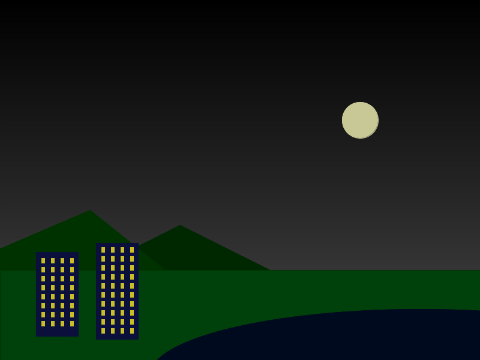

# Agenda

On day 3 we will use Processing to create a visual image.  Before you come to class, think about what image you would like to create.  Your image should consist of simple geometric shapes, so it should be fairly abstract.  Also, there should be repeated elements.

Here is an image we created using Processing (click for full size), which you might find useful as an example of creating a scene using simple shapes:

> 

Your image definitely does not need to look anything like ours.  We do have one request: please make your image G-rated, and avoid including anything that might be considered offensive.  Thank you.

Also: we would highly recommend installing [Processing](http://processing.org), installing it on your own computer, and trying out some of the code examples in Chapters 1 and 2 of Learning Processing.

## Get ready

Using the graph paper provided in class, draw a sketch of your image.  Your sketch should consist of simple geometric shapes, such as rectangles, ellipses, triangles, etc.  In [Lab 1](../labs/lab01.html), which we will work on in class, you will start to translate your sketch into Processing code.

If you need to print additional sheets, use this: [graphpaper.pdf](../media/graphpaper.pdf)

