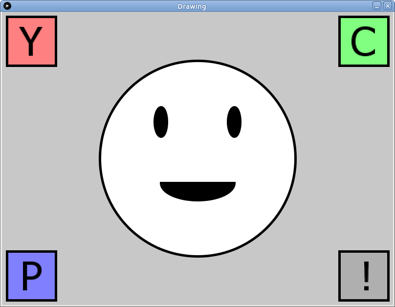

# Learning goals

* Understand the basic elements of a Processing sketch
* Understand how to run sketches in the Processing environment
* Use Processing drawing functions to draw shapes

# What to do

## Part 1: Setting up Processing

Start Processing by clicking the start menu, then choosing **Programs**, then **Processing**.

## Part 2: Importing the example sketch

Download the following zip file and save it in your **Downloads** folder: [Drawing.zip](Drawing.zip).

Start a file browser window and navigate to your **Downloads** folder.  Right click on **Drawing.zip**.  Choose **Extract All**, then choose `H:\My Documents\Processing` as the destination directory.

In Processing, choose **File &rarr; Open**.  In the file chooser dialog, navigate to `H:\My Documents\Processing`, then double click on `Drawing`, then choose `Drawing.pde`.  You should now have a Processing window with the source code of the example sketch.

Click the run button, which looks like this:

> 

## Part 3: Drawing with Processing

When the sketch runs, it draws a smiley face and some boxes (click for full size):

> 

*Read through the code for the sketch*.  There are comments (lines of text beginning with "//") describing what each section of code is doing.

Now let's try changing some stuff!

Find the code (in the `draw` function) that reads


// Use white fill
fill(255);


Try changing it to


// ???
fill(127);


Run the sketch again.  What happened?

Now change it to


// ???
fill(194,200,93);


How did that change things?  Experiment with different numeric values.  Each value should be an integer between 0 and 255.  Suggestion: try setting two of the values to 0 and one of the values to 255.  What happens when the first value is 255?  The second?  The third?

Now find the code (again, in the `draw` function) that reads


// Large circle centered at 400,300
ellipse(400,300,400,400);


Try changing it to


// ???
ellipse(400, 300, 500, 500);

 
Run the sketch again. What happened?  Now try


// ???
ellipse(400, 300, 300, 300);


How did that change things?  Next, try


// ???
ellipse(200, 300, 400, 400);


What happened?  Finally, try


// ???
ellipse(600, 300, 400, 400);


Try some other values for the `ellipse` command to change the placement and/or size of the ellipse.

Next: find the code reading


// Black-filled arc (part of an ellipse)
arc(400,350,150,70,0,PI,CHORD);


Change it to


// ???
arc(400, 350, 150, 70, PI, PI+PI);


What happens?

Finally, find the code


// Use thick black borders on shapes
stroke(0);
strokeWeight(5);


Change it to


// ???
stroke(85, 15, 157);
strokeWeight(10);


What did that do?

## Part 4: Making your own drawing

At this point, you probably have a pretty good idea of what's going on in a basic Processing sketch:

* `setup` is for code that runs when the sketch starts, and it can set the size of the window, set a background color, and other do other "just once" operations
* `draw` is for code that does drawing operations
* the origin point (0, 0) is the upper left corner of the window
* x coordinates increase going to the right
* y coordinates increase going down
* fill and stroke colors can be black (0), white (255), gray (somewhere between 0 and 255), or arbitrary colors (red, green, and blue component values, each within the range 0-255)

You can consult the [Processing reference](https://processing.org/reference/) for a complete list of all Processing functions, including the drawing functions.

To finish up, please start your own Processing sketch by following the instructions in the **Getting started** section of [Assignment 2](../assign/assign02.html).  This should create a sketch called `VisualArtProject`.

In the time remaining, start to translate the sketch you made on the [graph paper](../media/graphpaper.pdf) into drawing operations in your new Processing sketch.  You probably won't be able to create the entire image, but if you do at least a few shapes, that's great.
