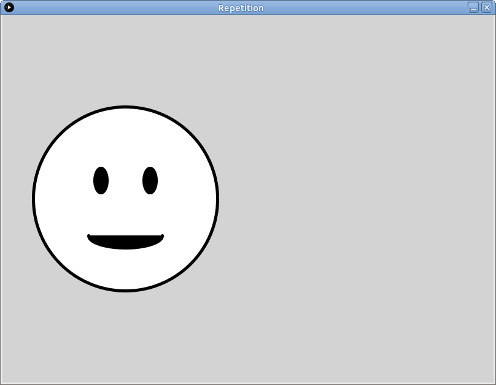

# Learning goals

* Use *procedural abstraction* to avoid repeated code when drawing similar or identical elements

# What to do

## Part 1: Import the example sketch

Download the following zip file and save it in your **Downloads** folder: [Repetition.zip](Repetition.zip).

Start a file browser window and navigate to your **Downloads** folder.  Right click on **Repetition.zip**.  Choose **Extract All**, then choose `H:/My Documents/Processing` as the destination directory.

In Processing, choose **File &rarr; Open**.  In the file chooser dialog, navigate to the `H:\My Documents\Processing` folder, then double click on **Repetition**, then choose **Repetition.pde**.  You should now have a Processing window with the source code of the example sketch.

Click the run button, which looks like this:

> 

When the sketch runs, you should see the following (click for full size):

> 

## Part 2: Repeated elements

This sketch is nice and all, but more smiley faces would be better.  How can we add another one?

Let's say that we want to add another smiley face to the right of the first one.  As we know from [Lab 1](lab01.html), x-coordinates increase as we go to the right.  So, we could just repeat the drawing operations that draw the first face, but increase each x-coordinate by a fixed amount, leaving y-coordinates, width and height, and other drawing values unchanged.

So: add the following code to the `draw` function, just below the code that draws the first smiley face:


// Draw another smiley face
fill(255);
ellipse(200+400, 300, 300, 300);
fill(0);
ellipse(160+400, 270, 20, 40);
ellipse(240+400, 270, 20, 40);
arc(200+400, 360, 120, 40, 0, PI);


This code is very similar to the code that draws the first smiley face.  Note how we can just put `+400` after any value to increase it by 400.  Processing will do the math for us, which is awesome.

Run the sketch again.  What do you see now?

## Part 3: Reference point, variables

When we want to draw the same thing in more than one place, the "copy code and tweak it" approach works, but it's tedious.  What if there were a way we could use the *same* code to draw the same thing in more than one place?

Good news: there is a way!  The idea is to do all of our drawing operations relative to a *reference point*.

For our smiley face, let's put the reference point right in the center:

> 

We'll refer to the x- and y-coordinates of the reference point as `smileyX` and `smileyY`.  Here is how we can change the code to make all of the drawing operations relative to coordinates of the reference point:


// Draw a smiley face
fill(255);
ellipse(smileyX, smileyY, 300, 300);
fill(0);
ellipse(smileyX-40, smileyY-30, 20, 40);
ellipse(smileyX+40, smileyY-30, 20, 40);
arc(smileyX, smileyY+60, 120, 40, 0, PI);


Let's break this down.

In the first use of `ellipse`, which draws the large circle, we specify the center x- and y-coordinates as exactly `simleyX` and `smileyY`.  This makes sense: the circle's center is exactly at the reference point.

In the second use of `ellipse`, which draws the left eye, we want the center x-coordinate to be to the left of (less than) the reference point, and the center y-coordinate to be above (less than) the reference coordinate.  The original center was at (160, 270): the x-coordinate is 40 units less than the big circle's original center x-coordinate (200), and the y-coordinate is 30 units less than the big circle's original center y-coordinate (300).  So, the center x- and y-coordinates of the left eye become `smileyX-40` and `smileyY-30`, respectively.  (Just as `+` means "add" in Processing, `-` means "subtract.")

"That's great," you say, "but what the heck are `smileyX` and `smileyY`?  Are they real things?"  Heck yeah, they are!  Processing allows us to define *variables*: these are named storage locations where we can store information such as reference point coordinates.  All we need to do is define variables called `smileyX` and `smileyY`, and set them to the specific coordinates we want to use as the reference point.  Here's the whole shebang:


int smileyX = 200;
int smileyY = 300;

// Draw a smiley face centered at (smileyX, smileyY)
fill(255);
ellipse(smileyX, smileyY, 300, 300);
fill(0);
ellipse(smileyX-40, smileyY-30, 20, 40);
ellipse(smileyX+40, smileyY-30, 20, 40);
arc(smileyX, smileyY+60, 120, 40, 0, PI);


Copy this code into the sketch, replacing the original code to draw the first smiley face.  Run the sketch: you should see the first smiley face in its original location.  Not very exciting, you say?  Well try this: change the values of `smileyX` and `smileyY` as follows:


int smileyX = 250;
int smileyY = 370;


Yeah that's right: *the smiley face is now in a different place, and all you had to do was change the values of a couple variables.* Take a moment to let this sink in.

>  <a class="sourceref" href="http://knowyourmeme.com/photos/301263-mind-blown">source</a>

## Part 4: Using a function!

"Using variables to define a reference point is kind of nifty," you say, "and I like being able to move the smiley face around so easily by just changing the values of the variables, but I don't see how that helps me draw multiple copies of the smiley face."  Give yourself a pat on the back!  You're exactly right.  It doesn't, because *the code that draws the smiley face only runs one time*.

Now...prepare yourself for the most amazing programming technique of all: *the function*.

A function is a chunk of code that we can execute whenever we want, however many times we want.  Functions can have *parameters*, which are variables whose values can be controlled whenever we use, or *call*, the function.

Let's define a function to draw our smiley face.  The function will have two parameters, `smileyX` and `smileyY`, to control the smiley face's reference point.  Here it is:


// Draw a smiley face centered at (smileyX, smileyY)
void drawSmiley(int smileyX, int smileyY) {
  fill(255);
  ellipse(smileyX, smileyY, 300, 300);
  fill(0);
  ellipse(smileyX-40, smileyY-30, 20, 40);
  ellipse(smileyX+40, smileyY-30, 20, 40);
  arc(smileyX, smileyY+60, 120, 40, 0, PI);
}


You can copy this into your sketch at the bottom of the file, after the closing curly brace ("`}`") of the `draw` function.  Note that the code inside the body of the function (between the curly braces, "`{`" and "`}`") is *exactly the same* as the earlier code we used to draw the smiley face relative to a reference point.

Now, change the `draw` function so that it looks exactly like this:


void draw() {
  stroke(0);
  strokeWeight(5);

  drawSmiley(200, 300);
  drawSmiley(600, 300);
}


Run the sketch.  Yes, that's two smiley faces!  But what just happened, exactly?  What happened is that the first call to `drawSmiley` specified `200`, `300` as the values of the `smileyX` and `smileyY` parameters, and the second call specified `600`, `300` for those values.

Now try changing the `draw` function to look like this:


void draw() {
  stroke(0);
  strokeWeight(5);

  drawSmiley(180, 180);
  drawSmiley(620, 180);
  drawSmiley(400, 420);
}


That's right.  By *calling* the `drawSmiley` function, and specifying the exact reference point coordinates, we can make as many smileys as we want, wherever we want them.  Heck yeah.

>  <a class="sourceref" href="http://giphy.com/gifs/nyan-cat-sIIhZliB2McAo">source</a>

Just for reference, here's the complete sketch with the function, just so you can make sure that your version is correct (just click on the link to see the code):

> [RepetitionWithFunc.pde](https://github.com/ycpcs/fys100-fall2016/blob/gh-pages/labs/RepetitionWithFunc.pde)

## Part 5: Using a function to draw repeated elements in your sketch

Now, it's time to apply the same technique to your sketch!  (I.e., the one you started in [Lab 1](lab01.html) and are working on as part of [Assignment 2](../assign/assign02.html).)

Find a figure in your sketch that you would like to repeat.  If you have not done so already, use Processing drawing functions (i.e., `ellipse`, `rect`, etc.) to draw one copy of the figure in a fixed location.

Next, change the code to draw the figure so that all of the drawing operations are done relative to a reference point.  Introduce variables to store the x- and y-coordinates of the reference point (just like with did with the smiley face above.)  Make sure the program still works as before.

Next, introduce a function to draw the figure: the reference point variables will become the parameters of this function.  (I.e., make something similar to the `drawSmiley` function, but have it draw your figure.)  Make sure that your sketch's `draw` function has exactly one call to your new function.  Make sure that when you run the sketch it still works correctly.

Now, try using multiple calls to your function to draw multiple copies of the figure in different locations!

Note that we don't necessarily expect you to do all of this in class.  Please continue to work on this outside of class.
