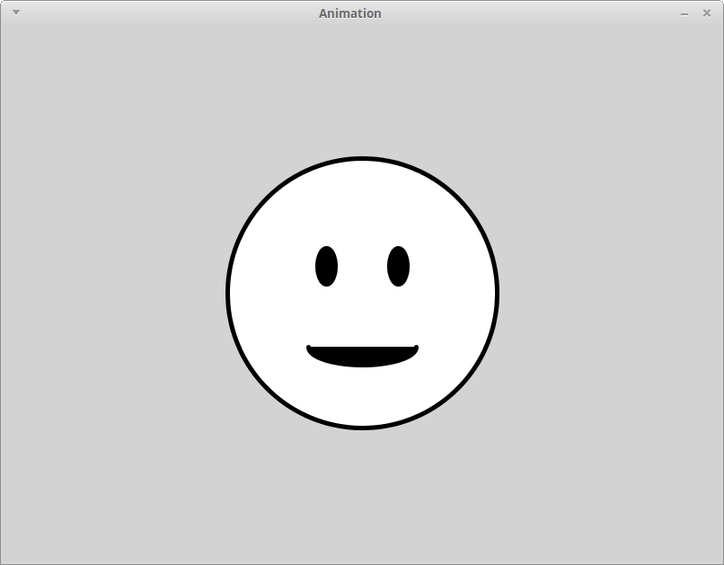

# Learning goals

* Animate elements of an image by varying their positions, sizes, and/or colors over time

# What to do

## Part 1: Import the example sketch

Download the following zip file and save it in your **Downloads** folder: [Animation.zip](Animation.zip).

Start a file browser window and navigate to your **Downloads** folder.  Right click on **Animation.zip**.  Choose **Extract All**, then choose `H:\My Documents\Processing` as the destination directory.

In Processing, choose **File &rarr; Open**.  In the file chooser dialog, navigate to the `H:\My Documents\Processing` folder, then double click on **Animation**, then choose **Animation.pde**.  You should now have a Processing window with the source code of the example sketch.

Click the run button, which looks like this:

> 

When the sketch runs, you should see the following (click for full size):

> 

## Part 2: Animation basics

Ok, this initial version of the sketch isn't an animation: nothing moves!  Let's fix that.

We'll start by observing that there are some variables defined just before the `setup` function:


// Variables to control where the smiley face appears
int x, y;
int dx, dy;
float theta;


Because these variables aren't defined inside a function, these variables can be used by any function in the program.

Also note the code in the `draw` function that calls the `drawSmiley` function:


drawSmiley(x, y);


What is happening is that the center of the smiley face will be positioned so that its center is at the coordinates stored in the `x` and `y` variables.  But hang on, it looks like the smiley face is positioned in the middle of the window.  Where are the values of `x` and `y` coming from?

The answer is that the *initial* values of `x` and `y` are assigned in the `setup` function:


// Provide initial values for the animation variables.
x = 400;
y = 300;
dx = 1;
dy = 1;
theta = 0;


Now for the fun part.  Find the comment in the `draw` function that reads


// TODO: change the animation variables!


Change it to


// TODO: change the animation variables!
x = x + 1;


Run the sketch again.  What do you see?  ([Click here to see.](demo/lab03/anim1.html))

So, what just happened?

This lab's sketch makes a couple of important changes compared to the one from [Lab 2](lab02.html).  Its `setup` function no longer uses the `noLoop` command, which means the sketch's `draw` function will be executed 60 times per second, rather than only being executed once.  The `draw` function uses the `background` command to clear the window background, so we get a "clean slate" each time `draw` is executed.  Finally, and most importantly, the code


x = x + 1;


increases the value of the `x` variable each time `draw` is executed.  This makes the smiley face move (slowly) to the right, since in each animation frame, its center is shifted right one unit.

(You may have noticed that from a mathematical standpoint, "`x = x + 1`" is nonsense.  What's going on is that in Processing, the `=` symbol means "change the value of the variable on the left," not "is equal to."  So, the full meaning of "`x = x + 1`" is "add one to the current value of `x`, then change the value of `x` to the result of the addition.")

## Part 3: Things to try

By changing the way that the animation variables are updated in the `draw` function, we can achieve different effects.  Here are some to try.  Try to guess what happens for each one.  (You can click the "See it" links to find out, or run it yourself.)

First version ([See it](demo/lab03/anim2.html)):


// TODO: change the animation variables!
x = x - 1;


Second verion ([See it](demo/lab03/anim3.html)):


// TODO: change the animation variables!
x = x + 1;
y = y + 1;


Third version ([See it](demo/lab03/anim4.html)):


// TODO: change the animation variables!
if (x < 150 || x > 650) {
  dx = dx * -1;
}
if (y < 150 || y > 450) {
  dy = dy * -1;
}
x = x + dx;
y = y + dy;


(See if you can figure out how this one works.  Note that in Processing, "`||`" means "or".)

Fourth version ([See it](demo/lab03/anim5.html)):


// TODO: change the animation variables!
theta = theta + 0.02;
x = int(400 + sin(theta) * 150);
y = int(300 + cos(theta) * 150);


(You might need to recall your high school trigonometry for this one!  Note that this last one is a bit different than the others because the `theta` variable is changing each time `draw` is executed, and `x` and `y` are recomputed based on the current value of `theta`.)

## Part 4: Animation in your own sketch

We've just scatched the surface of animations in Processing, but hopefully this lab gives you some ideas.

At this point, try adding animation variables to the Processing sketch you're working on for [Assignment 2](../assign/assign02.html), and using them to change the position and/or size of the figure drawn by the drawing function you added to your sketch in [Lab 2](lab02.html).

Note that you will need to make some changes to your sketch:

* Remove the use of the `noLoop` command from your `setup` function
* Move the `background` command from your `setup` function to the beginning of your `draw` function

In addition, you can change the default frame rate (60 frames per second) by using the `frameRate` command.  For example, if you want the frame rate to be 30 frames per second, use the command


frameRate(30);


in the `setup` function.
