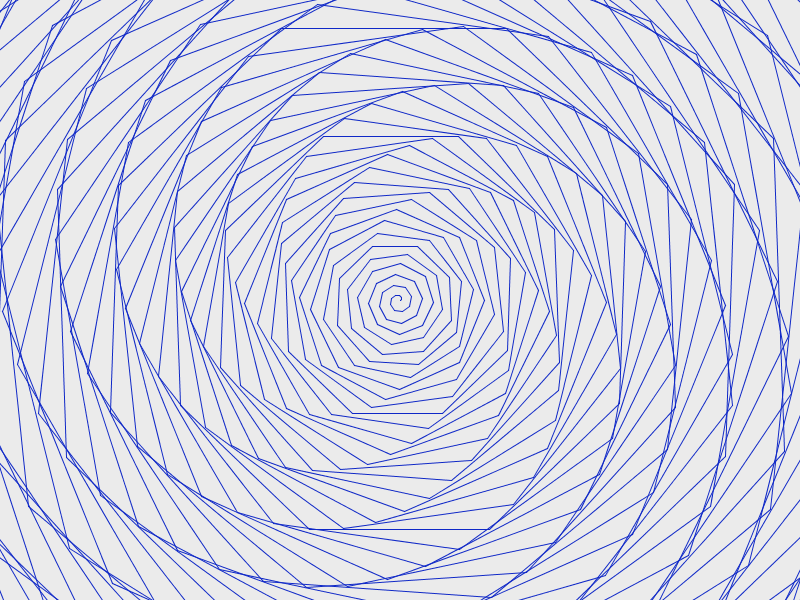
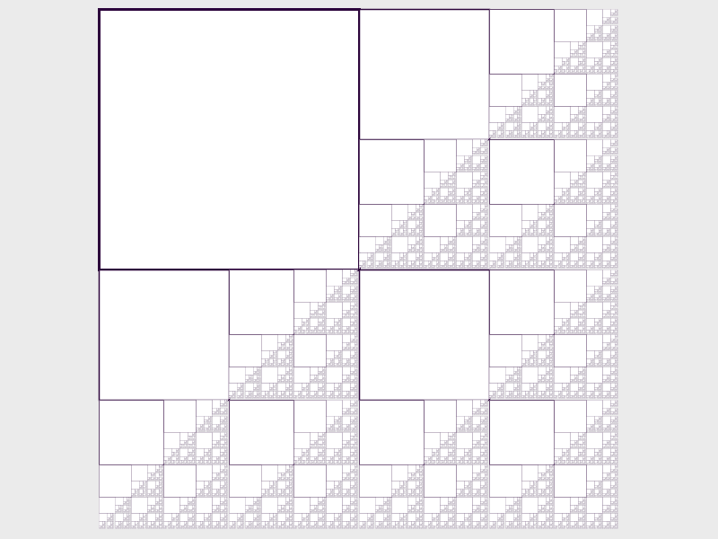
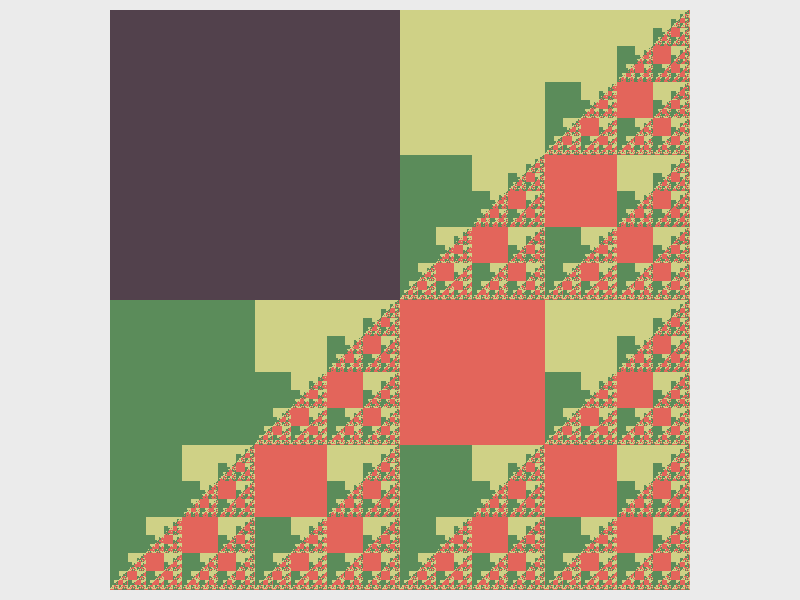

> *Big fleas have little fleas,* *Upon their backs to bite 'em,* *And little fleas have lesser fleas,* *and so, ad infinitum.*

# Learning goals

* Use turtle graphics and Processing drawing functions to generate images from simple rules
* Appreciate how self-similarity at varying scales leads to "natural"-looking images
* Understand how to use a recursive method to generate a fractal image

# What to do

Your task is to use turtle graphics and Processing drawing functions to draw cool-looking images, and in particular, fractal images.  The general idea is that the sketch should use a procedure based on simple rules to create the image.

That's really the only task!  Just mess around and see if you can create some interesting images by modifying and extending some of the examples shown below.  Don't forget to save your favorite sketches in your Processing sketchbook folder.

Each example below is a complete sketch.  You can simply create a new sketch in Processing and then copy and paste the code.  Use **File** &rarr; **Save As...** if you would like to save your own version of one of the example sketches.

# Turtle graphics

Here's a quick explanation of the turtle graphics commands used in some of the example sketches below.  ([Turtle graphics](https://en.wikipedia.org/wiki/Turtle_graphics) were invented as part of the [Logo](https://en.wikipedia.org/wiki/Logo_\(programming_language\)) programming language, and have a long and rich history in programming and computer art.)

The code `import terrapin.*;` at the top of a sketch means we're using the [Terrapin](http://terrapin.sourceforge.net/) Processing library.  A Processing library adds new commands that you can use in your sketches to do cool things.

The code `Terrapin t = new Terrapin(this);` makes the variable `t` refer to a new Terrapin.  You can think of a Terrapin as a turtle facing a particular direction and dragging a pen.  By telling the turtle when to turn and when to move forward, you can use the turtle to draw shapes.

The code `t.setLocation(x, y);` sets the Terrapin's location to the specified x/y coordinates.  These might be literal values (e.g., 400, 300) or they could be variables.

The code `t.setPenColor(r, g, b);` sets the Terrapin's pen color to the specified R/G/B values.

The code `t.forward(dist);` moves the Terrapin forward by the specified distance.

The code `t.left(angle);` and `t.right(angle);` rotates the turtle left or right by the specified angle.  The angle is specified in degrees, e.g., 90 would indicate a 90 degree turn.

## Example sketch 1: spiral

Here is a simple example:


import terrapin.*;

void setup() {
  size(800,600);
  background(235);
  noLoop();
}

void draw() {
  Terrapin t = new Terrapin(this);
  t.setLocation(400,300);
  
  t.setPenColor(15,40,199);
  
  for (int i = 0; i < 500; i++) { // repeat 500 times
    t.forward(i);
    t.left(44);
  }
}


This example produces the following output (click for full size):

> 

So, what is going on here?

* The `setup` method sets the window size and background color, and uses `noLoop` so that the `draw` method is only executed once (i.e., it's not an animation)
* The `draw` method creates a Terrapin (turtle), sets its location to 400,300 (at the center of the window), and sets its pen color to a shade of blue
* The for loop repeats, for values of the variable `i` from 0 to 499: move forward `i` pixels of distance, and then turn left 44 degrees

Try modifying this sketch.  What happens if you change the amount by which the turtle moves forward at each step?  (Try `i*2` instead of `i`.)  What happens if you change the turn angle to make it larger or smaller?  What happens if you use the `right` command instead of `left`?

## Example sketch 2: a fractal tree

Here is an example of a fractal:


import terrapin.*;

float startLen = 150;
float decay = .75;
int angle = 35;

void setup() {
  size(800, 600);
  background(235);
  noLoop();
}

void draw() {
  Terrapin t = new Terrapin(this);
  t.setLocation(400,600);
  t.setRotation(270);
  t.setPenColor(0,89,14);
  
  drawTree(t, startLen);
}

void drawTree(Terrapin t, float dist) {
  if (dist > 5) {
    strokeWeight(4 * (dist/startLen));
    
    t.forward((int)dist);
    
    Terrapin copy = new Terrapin(t);
    
    t.left(angle);
    copy.right(angle);
    
    drawTree(t, dist * decay);
    drawTree(copy, dist * decay);
  }
}


This produces the following image (click for full size):

> 

Let's analyze this sketch.

At the top of the sketch, we define some _global variables_.  These are variables that are visible throughout the sketch.  The `startLen` variable defines the length of the first tree segment.  The `decay` variable controls how rapidly the length of the tree segments decreases as more segments are added.  The `angle` variable controls the angle of the "branches".

The `setup` method is the same as the previous sketch: it just sets the window size, background color, and calls `noLoop` to specify that the `draw` method should only be executed once.

The `draw` method creates an initial Terrapin (turtle), positions it at the bottom of the window, and orients it so that it is pointing straight up.  It also sets the drawing color to a shade of green.  Finally, it calls the `drawTree` method with the initial Terrapin and initial segment length as parameters.

The `drawTree` method is where the interesting stuff happens.  The `if` construct checks to see if the `dist` parameter is greater than 5: if not, then the method does nothing.  If `dist` is greater than 5, then the method moves the Terrapin `t` forward by `dist` number of pixels.  (Note that it is necessary to convert `dist` to an integer value.)  Next it creates a copy of the Terrapin `t`, called `copy`.  Both Terrapins (`t` and `copy`) are rotated by `angle` number of degrees, but in opposite directions.  Finally, the `drawTree` method is called with Terrapins `t` and `copy`, and with the `dist` parameter set to `dist * decay`.  (Since `decay` is a value less than 1, this causes `dist * decay` to be a smaller value than `dist`.)

Wait...what?

The `drawTree` method uses a technique called _recursion_.  The idea is that to draw a tree, we use a single turtle to draw an initial segment, and then "split" into two separate turtles, each oriented at a different angle, and then use these two turtles to draw *slightly smaller trees*.  In other words: a tree is a segment (you can think of this as the trunk, or a branch) that splits into two smaller trees.  However, these smaller trees _are formed in exactly the same way as the overall tree_.  Since the `drawTree` method draws a tree (whose size is based on the value of the `dist` parameter), it makes sense for the `drawTree` method to _call itself_ to draw the smaller trees.

In programming, recursion only works if it "bottoms out" at some point.  That is the purpose of the `if` construct: once the segment length (`dist`) falls below a specified minimum threshold, the process stops.  You can think of this as occurring at the "leaves" of the tree.  Without the `if` construct, the recursion would never "finish".

Try experimenting with this sketch.  What happens if you change the values of the `startLen`, `decay`, and/or `angle` variables?  What happens if you use a minimum segment length threshold other than 5?  Could you make the angle vary?  Could you introduce some randomness?

## Example sketch 3: squares

Fractals can be created by simple rules.  For example, let's say we want to create a fractal image in a square area.  Here are some possible rules

1. Draw a square in the upper-left quadrant
2. Recursively draw fractals in the lower-left, upper-right, and lower-right quadrants of the area

As with the fractal tree, we need to ensure that the procedure eventually "bottoms out".  So, if the width of the area in which a recursive fractal is drawn fall below a minimum threshold, we do nothing.

Here is the code:


void setup() {
  size(800,600);
  background(235);
  noLoop();
}

void draw() {
  stroke(45,5,60);
  drawSquares(110,10,580,580);
}

// The parameters describe a square area with upper-left
// corner at x,y, width w, and height h
void drawSquares(float x, float y, float w, float h) {
  if (w > 2) {
    // Draw square in upper-left quadrant
    strokeWeight(3 * (w/580));
    rect(x, y, w/2, h/2);
    
    // Recursive fractals in the lower-left, upper-right,
    // and lower-right quadrants
    drawSquares(x, y + h/2, w/2, h/2);
    drawSquares(x + w/2, y, w/2, h/2);
    drawSquares(x + w/2, y + h/2, w/2, h/2);
  }
}


Note that this code does not use turtles, but instead uses normal Processing drawing functions.

Here is the image produced (click for full size):

> 

Try modifying this program.  What happens if you comment out one of the recursive calls to `drawSquares`?  What happens if you change the stroke color before each recursive call?  What happens if you draw a different shape instead of a square?  What happens if you fill the squares with a solid color?  Could you create a similar fractal using a different shape, such as a triangle or rectangle?

I messed around a bit and came up with this variation (click for full size):

> 

# Your turn

Think about how you might use a fractal or other generative technique in the sketch you are working on as part of [Assignment 3](../assign/assign03.html).
