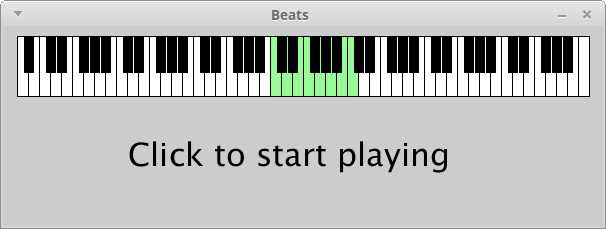

[comment]: <Possibly remove the melody section from here since it is covered in Lab 6. Possibly it is too much for one day>

# Learning goals

* Learn about and experiment with rhythms
* Learn about and experiment with bass lines
* Learn about and experiment with soundfonts
* Learn about the MIDI standard and the GM1 soundset

# What to do

In today's lab you will experiment with rhythm and bass patterns.

## Computers and music

As computers have become more powerful, their capability to generate sound has expanded.  Today, not only is it *possible* to create music on a computer, it is commonplace for computers to be used in the production of music.  In many music genres (electronica, hip hop, etc.) computers are the primary creative medium.

In the music unit of the course (which starts today), we will explore writing *programs* to create music.

## MIDI, Soundfonts

There are two technologies we will need to discuss before we get started: MIDI and Soundfonts.

[MIDI](https://www.midi.org/), which stands for Musical Instrument Digital Interface, is a standard for representing music and controlling musical instruments.  It was invented in the 1980s, and remains the most widely used standard for digital music.

MIDI is based on the idea of *messages*.  A MIDI message indicates that a particular note or instrument sound should start or stop playing at a particular instant in time.  Music is composed and played by generating MIDI messages and delivering them to an instrument capable of interpreting them and rendering them as sounds.

MIDI represents musical notes as *note numbers*, which correspond to notes in standard (Western) music notation.  For example, note number 69 is A4, i.e., the note A in the fourth full octave on a piano keyboard.  See this handy [MIDI note number](https://newt.phys.unsw.edu.au/jw/notes.html) diagram for more information.

MIDI represents instruments abstractly as *patch numbers*.  Essentially, different patch numbers indicate different instruments.  The [GM1 sound set](https://www.midi.org/specifications/item/gm-level-1-sound-set) is the most common way to assign patch numbers to instrument sounds.  For example, patch 1 in the GM1 sound set is "Acoustic Grand Piano".  Special MIDI messages can be used to select a patch number, allowing control of instrument sounds.

The precise way that MIDI messages are translated into instrument sounds depends on the device that is responsible for interpreting and rendering MIDI notes.  In this course, we will be using a software synthesizer called Gervill that is built into Processing.  Gervill can generate its own sounds, but they are very dull, so we won't be using them.  Instead we will be using *soundfonts*.  A soundfont is a collection of instrument sounds that can be used to render MIDI notes.  By telling Gervill which soundfont or soundfonts we want to use in a composition, we have control over the sound of the notes played.

There are lots of soundfonts available for free download: the [Hammersound](http://www.hammersound.net/) website is a good one, but there are many others.  On the computers in KEC 123, we have created a directory `C:/SoundFonts` containing a selection of good soundfonts.

## Rhythms, Melodies, and Figures

Please read the [Basics documentation](https://github.com/daveho/FunWithSound/wiki/Basics) for the FunWithSound library, which provides an overview of all of the important FunWithSound concepts.  In particular, make sure you know what *instrument*, *rhythm*, *melody*, and *figure* refer to.

## Beats

Let's start with a first sketch.  Start Processing.  Then, click on the following link and copy the program text into your Processing window:

> [Beats.pde](https://github.com/ycpcs/fys100-fall2016/blob/gh-pages/labs/demo/lab05/Beats.pde)

Save the sketch as `Beats`.  Run the sketch.  You should see the following:

> 

Plug in your headphones and *adjust the system volume to a low setting*.  Run the sketch and click the mouse in the window.  You will hear 8 electronic bass drum beats.  (If you don't hear them, raise the volume a bit and click again.)  So what is going on?

The important part of the sketch is the `create` function.  This function is responsible for creating instruments, rhythms, melodies, figures, and arranging the figures into a composition.  Basically, this is the function where you specify what you want to hear.  Let's take a look at what we have in this initial `create` function.


tempo(110, 4);
major(60);


These lines set the tempo to 110 beats per minute and 4 beats per measure, and set the scale to a major scale rooted at MIDI note 60, which is C4.


Instrument drumkit = percussion(TR808); // Roland TR-808 sounds
Instrument bass = instr(FLUID, 36); // fretless bass
v(bass, 0.5); // make the bass a bit quieter


These lines create two instruments called `drumkit` and `bass`.  The `drumkit` instrument is a percussion instrument which plays sounds from the `TR808` soundfont.  The `bass` instrument is a melodic instrument which plays sounds from patch 36 in the `FLUID` soundfont.  (Patch 36 is "Fretless Bass" in the GM1 sound set, which is the encoding that the `FLUID` soundfont supports.)  The `v` function is used to adjust the volume of the `bass` instrument to 50% of full volume.  (It's too loud otherwise.)


Rhythm kickr = r(p(0), p(1), p(2), p(3));


This line creates a rythm called `kickr` which has "strikes" on beats 0, 1, 2, and 3.  (The FunWithSound library considers 0 to be the first beat in a measure.)  This is the classic "four on the floor" rhythm heard frequently in dance music.


Figure kickf = pf(kickr, 36, drumkit);


This line creates a figure called `kickf` which plays the rhythm `kickr` using note 36, which is "Bass Drum 1" in the GM1 percussion key map, and using our `drumkit` instrument.  The idea is that percussion instruments don't play notes with different pitches; instead, each note plays a different percussion sound.  See the [GM1 sound set](https://www.midi.org/specifications/item/gm-level-1-sound-set) (scroll to the bottom of the page) for the full list of percussion sounds.  Note that not all soundfonts support all of the percussion sounds.


add1(gf(kickf));
add1(gf(kickf));


These lines schedule the `kickf` figure to be played twice.  Basically, each call to `add1` specifies the figure or figures to be played in one measure of the composition.  (The use of the `gf` function allows multiple figures to be specified.)  Since we have two calls to `add1`, each of which plays `kickf`, we hear the "four on the floor" pattern twice.

**Experiment to try.** Try changing the definition of `kickr` to:


Rhythm kickr = r(p(0), p(2), p(2.5));


Restart the sketch and click to play.  How did the pattern change?

## Snare

Just after the definitions for `kickr` and `kickf`, add the following code:


Rhythm snarer = r(p(1), p(3), p(3.25), p(3.75));
Figure snaref = pf(snarer, 40, drumkit);


Next, change the lines that call the `add1` function from:


add1(gf(kickf));
add1(gf(kickf));


to


add1(gf(kickf, snaref));
add1(gf(kickf, snaref));


This adds a snare drum pattern to the bass drum beats: for both of the measures we've added to the composition, we are playing both `kickf` (the kick drum figure) and `snaref` (the new snare drum figure).  (For percussion instruments, note 40 is "Electric Snare".)

Note how we've used fractional beat numbers to add a bit of syncopation to the composition.

## Hihats

No dance music beat would be complete without some hihats.  Add the following code just after the definition of `snarer` and `snaref`:


Rhythm hihat1r = r(p(.25), p(.375), p(.5), p(1), p(1.5));
Figure hihat1f = pf(hihat1r, 42, drumkit);
Rhythm hihat2r = r(s(2, 1), s(3, 1));
Figure hihat2f = pf(hihat2r, 46, drumkit);


Next change the lines that call the `add1` function from


add1(gf(kickf, snaref));
add1(gf(kickf, snaref));


to


add1(gf(kickf, snaref, hihat1f, hihat2f));
add1(gf(kickf, snaref, hihat1f, hihat2f));


Note that we defined two rhythms and two figures because we're using two distinct hihat sounds: note 42 is "Closed Hi Hat", and note 46 is "Open Hi Hat".  Also note that rather than using `p` to specify the strikes for the open hihat sounds, we used `s`, which allows us to specify a duration.  Open hihats are sustained, so we need to specify how long they should "ring".

## Bass

Now let's add some bass.  Melodic figures are a little more complicated because we need to think about the sustain for each note, and of course we need a melody.  Try adding the following just below `hihat1r`, `hihat1f`, `hihat2r`, and `hihat2f`:


Rhythm bassr = r(
  s(.5, .25), s(1, .25), s(1.25, .25), s(1.75, 1.25),
  s(4.5, .25), s(5, .25), s(5.25, .25), s(5.75, .5),
  s(6.5, .25), s(7, .25), s(7.25, .5)
);
Melody bassm = m(
  -16,-16,-16,-16,
  -20,-20,-20,-19,
  -14,-14,-14
);
Figure bassf = f(bassr, bassm, bass);


Now change the calls to `add1` from


add1(gf(kickf, snaref, hihat1f, hihat2f));
add1(gf(kickf, snaref, hihat1f, hihat2f));


to


add1(gf(kickf, snaref, hihat1f, hihat2f, bassf));
add1(gf(kickf, snaref, hihat1f, hihat2f));
add1(gf(kickf, snaref, hihat1f, hihat2f, bassf));
add1(gf(kickf, snaref, hihat1f, hihat2f));


A few things to note:

* The `bassr` rhythm is two measures long (note how some of the start beats are greater than 4)
* Because `bassr` is two measures long, we only need to start it every other measure
* All of the strikes in the rhythm specify a duration in beats
* The notes in the `bassm` melody are negative, meaning that they are lower than the base note of the scale
* We increased the total number of measures from 2 to 4

In case you would like to see the entire demo sketch, click the following:

> [Beats2.pde](https://github.com/ycpcs/fys100-fall2016/blob/gh-pages/labs/demo/lab05/Beats2.pde)

## Some stuff to try!

This composition is obviously just a starting point.  Here are some things to try changing:

* Change the patch that the `bass` instrument uses: for example, patch 39 is "Synth Bass 1" (see the [GM1 sound set](https://www.midi.org/specifications/item/gm-level-1-sound-set) for the available patches)
* Try changing the tempo
* Try changing the base note of the scale (for example, 69 is A4)
* Try changing to a minor scale (e.g., `melodicMinor(60)` rather than `major(60)`)
* Try adding additional kick drum, snare, hihat, and bass figures to the composition
* Try adding more measures to the composition: one effective technique is to let the bass "drop out" for several measures (this is common in dub reggae, which influenced many electronic music genres)

## A more complete example

Here is a somewhat more complete example:

> [Thieves.pde](https://github.com/ycpcs/fys100-fall2016/blob/gh-pages/labs/demo/lab05/Thieves.pde)

Feel free to copy this into a blank sketch and run it.  (Apologies to [New Order](https://www.youtube.com/watch?v=VVQfJ5xCpuY).)

## Using FunWithSound

The [FunWithSound reference](https://github.com/daveho/FunWithSound/wiki/Reference) documentation has the complete details about how to use the available functions.

# Your turn

To finish up, please start your own music composition Processing sketch by following the instructions in the **Getting started** section of [Assignment 4](../assign/assign04.html).  This should create a sketch called `MusicComposition`.

Start adding code to create and play rhythms and bass lines to your sketch.

<!-- vim:set wrap: -->
<!-- vim:set linebreak: -->
<!-- vim:set nolist: -->
