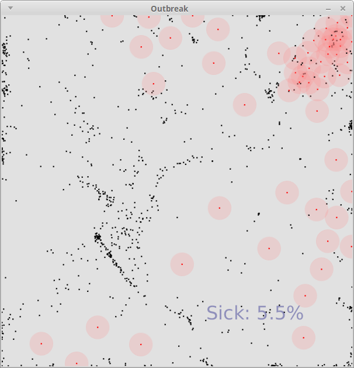

# Learning goals

* Explore simulation as a way of modeling and understanding natural phenomena

# What to do

A *simulation* is a program which simulates a natural phenomenon.  The idea is that the program uses a *model* of the phenomenon being studied, such that the model is a representation of particular aspects of the phenomenon being studied.  For example, in a weather simulation, the model might use representations of temperature, air pressure, humidity, and cloud cover over a field of simulated locations.  A simulation's model will also contain rules about how the simulation evolves over time.  For example, in a weather simulation, one of the rules might be that if two adjacent locations, if the air pressure is different, wind occurs to equalize the pressure (because air moves from regions with higher pressure to regions with lower pressure).

A simulation's model will also typically have *parameters*, which are values influencing how the model's rules are applied over time.  These parameters often come from known physical constants, in which case we set the parameters in order to match physical reality.  However, in some cases, changing the parameters may allow us to understand a broad class of phenomena: different combinations of parameters correspond to different "scenarios".

In this lab, we will experiment with the parameters of an "Outbreak" simulation, in order to learn about how factors in disease transmission affect a population of individuals.  See the *Outbreak* and *Experiments* sections for details about the simulation, and the experiments we will run.

## Outbreak

In this lab, we will experiment with parameters for a simulation of disease transmission in a population of inviduals.  Here is the code (which you should copy into Processing):

> [Outbreak.pde](https://github.com/ycpcs/fys100-fall2017/blob/gh-pages/labs/Outbreak.pde)

The initial conditions of the simulation are as follows:

* There is a population of individuals occupying a 600x600 area
* The initial locations of the individuals are distributed randomly
* Each individual has some probability of being sick initially, so the initial population is a mixture of healthy and sick individuals
* Each individual is either healthy or sick

At each time step of the simulation:

* Each individual will move: randomly if there are no sick individuals nearby, and as far as possible from sick individuals if there are some nearby
* With some probability, a healthy individual that is in proximity to a sick individual will become sick
* With some probability, a healthy individual that is *not* in proximity to a sick individual will become sick
* With some probability, a sick individual will recover and become healthy

When you run the program, it will display an animation showing the progress of the simulation.  There will be about 10 simulated time steps per second.  The simulation looks like this (click for full size):

> 

Black dots are healthy individuals, red dots are sick individuals.  The pink circles around sick individuals represent the radius in which disease transmission can occur.  The overall percentage of sick individuals is also displayed.  You can pause and unpause the simulation by pressing the space bar.

At the top of the program, you will notice definitions of the following simulation parameters:

> Parameter name | Description | Default value
> :------------: | ----------- | ------------:
> `MAXCROWD` | Individuals will always try to stay at least this distance from other individuals | 2.0
> `PARANOIA` | If any sick individuals are this close (or closer), try to move away from them | 160.0
> `NORMAL_MOVE_DIST` | How far individuals move normally, when they are not trying to get away from sick individuals | 3.0
> `ESCAPE_MOVE_DIST` | How far individuals move when they are trying to escape from sick individuals | 6.0
> `NUM_MOVES` | How many randomly-generated moves each individual will consider per time step | 10
> `INIT_SICK` | Probability that an individual is sick initially | 0.005
> `RECOVERY` | Probability per time step that a sick individual will spontaneously recover | 0.1
> `SPONTANEOUS_INFECT` | Probability per time step that a healthy individual will spontaneously become sick | 0.001
> `INFECT_RADIUS` | Radius surrounding a sick individual where transmission to a healthy individal may occur (this should not be greater than `PARANOIA`) | 20.0
> `INFECT` | Probability per time step of a healthy individual being infected by a sick individual that is close proximity | 0.05

By changing these parameters, you can study disease occurrence and transmission within the population.

## Experiments

Here are some experiments to try.  Write up the results of each experiment in a document in your shared Google Drive folder called **Outbreak Experiments**.  For each experiment, in addition to recording the results of the experiment, try to explain (in words) *why* you think the phenomenon you observed occurred.

1. When you start the simulation using the original values of the simulation parameters and let it run for a while, does the percentage of sick individuals stabilize (to a reasonable degree)?  If so, what is the (rough) percentage of sick individuals in the steady state?  If not, what do you think causes the instability?
2. What happens when you increase or decrease the `INFECT_RADIUS` parameter?  Try several values, and describe what happens for each value.  (Leave the other parameters at there original default values.)
3. What happens when you increase or decrease the `PARANOIA` parameter?  Try several values, and describe what happens for each value.  (Leave the other parameters at there original default values.)
4. What happens when you increase or decrease the `INFECT` parameter?  Try several values, and describe what happens for each value.  (Leave the other parameters at there original default values.)
5. What happens when you increase or decrease the `RECOVERY` parameter?  Try several values, and describe what happens for each value.  (Leave the other parameters at there original default values.)

After doing these experiments, think about how the simulation works, and answer the following question: Do you think the simulation is realistic?  Also, state one or more ways that the simulation could be made more realistic.

Finally, if you still have some time, try modifying multiple parameters at the same time.  See if you can find some combinations of parameters that cause interesting phenemona to occur.  Record the parameter combinations and a description of what happened.

## Just for fun

What if the sick individuals actively *pursue* the healthy individuals?  Now we're taking about *zombies*!  Create a new Processing window and copy the code from the following sketch into it:

> [Zombies.pde](https://github.com/ycpcs/fys100-fall2017/blob/gh-pages/labs/Zombies.pde)
