# Learning goals
* Utilize Scratch4Arduino (S4a) to interface with external sensors and actuators
* Describe the purpose/use of simple sensors such as a photocell, pressure sensor, and range finder.
* Describe the purpose/use of simple actuators such as an LED, servo, and motor.

# What to do

[comment]: 

## Part 1: Getting Started with Scratch
[Scratch](https://scratch.mit.edu) is a simple block-based programming language. If you can snap lego blocks together, then you can create a Scratch program. In this course we will use a variation of Scratch called [Scratch4Arduino](http://s4a.cat) (S4A). This modification allows Scratch to interface with external sensors.

In writing your programs you will need several things:
* An Arduino (see Figure 1)
* A USB cable to connect your Arduino to your PC
* The Scratch4Arduino software (already installed on your computer)

<b>Step #1</b> Connect your Arduino your PC via the USB cable.

<b>Step #2</b> Launch the s4a program from your desktop. You can do this by clicking on the Start Menu and then typing in "s4a". An icon should appear like below.

>

<b>Step #3</b> Scratch should launch and begin searching for your Arduino as shown below. Once the message "Searching for Arduino" goes away you're connected to the board.

>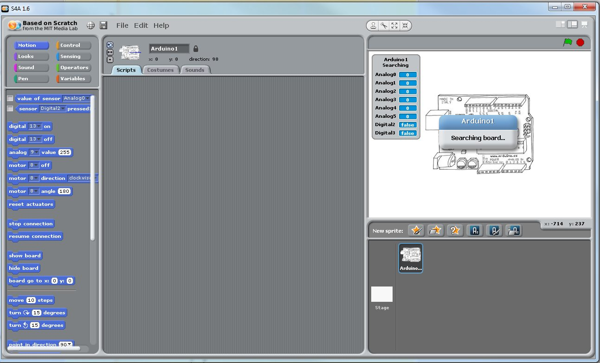

## Part 2: Getting to Know Your Arduino (Inputs and Outputs)
Before working with your Arduino you should get to know the various interfaces and pins that are available on the system. General purpose input/output (I/O) pins are the way in which your Arduino communicates with the outside world. There is no mouse, keyboard, monitor...etc that its uses to reading or produce information. These pins can either be <i>inputs</i> or <i>outputs</i>. An <i>input</i> pin brings information into the Arduino, while an <i>output</i> pin produces information or controls some other device.

>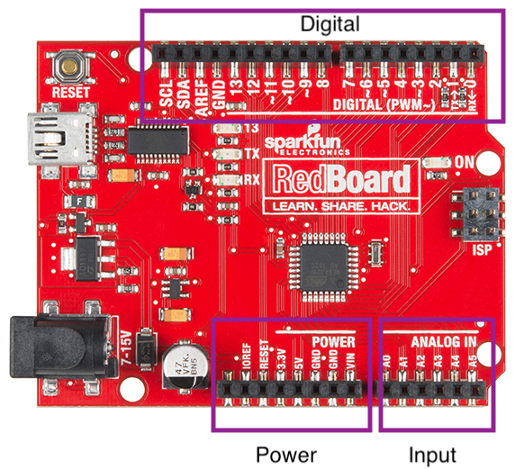
(Copyright SparkFun CC 2.0)

All of the I/O pins on the Arduino are located within three groups: <b>Digital Input/Output</b>, <b>Analog Input</b>, and <b>Power</b>. 

<i>Digital Input/Output</i> pins read in or produce a signal that is either ON or OFF. That is, the signal is either full power or no power at all. This can be useful in turning on an LED (on/off) or determining whether a switch has been pressed (on/off). Some Digital I/O pins are special Pulse-Width Modulation (PWM) pins and can approximate an analog pin. These PWM pins are denoted by a (~) symbol near their number.

The <i>Analog Input</i> pins allows the Arduino to read in analog values from the outside work. Unlike a digital value which exists as either ON or OFF, an analog signal can take on a range of signals. For example, an analog signal might range from any voltage between 0V and 5V to indicate the force experienced by a sensor. These pins are only inputs, meaning they do not produce any values, and accept any signal with a voltage between 0V and 5V.

Finally, the <i>Power</i> pins draw from the electrical supply of the Arduino and enable you to power other sensors and actuators. It is extremely important to wire devices up correctly to the power ports. If performed improperly you can burn out the Arduino, a sensor, or even the USB port on your computer. To prevent any damage from occuring, here are some general rules to follow:
* As a safety precaution, always wire up any new sensors/actuators with the power disconnected. Then myself or Dr. Hovemeyer will be happy to check your wiring before powering up the board again.
* <b>Never connect a wire directly between 5V/3.3V and GND.</b> This creates a short-circuit and you could damage the board or injure yourself.
* For a given device, never switch the 5V/3.3V and GND connections. This is the same as wiring a device up backwards. While some sensors may tolerate this (resistor), others will immediately burn out (everything else).
* Overall, these rules are designed to make sure you don't let the "magic smoke" out. If you see or smell something burning, disconnect from your computer immediately.

## Part 3: Your First Program - Blinking a Light
The most important and easiest program to write on any microprocessor is turning on and off a light. If you can accomplish that then you can perform most any required operation. Take a look at the LEDs on your Arduino. Identify the one that has a number beside it (13). We will use our commands within Scratch to turn on/off digital pin #13.

### Simple Blinking
Within Scratch each block is grouped by colors and shapes. Blocks that "snap" together, work together, and each small stack of blocks is its own program. Within the "Motion" tab select the "Digital On" and "Digital Off" blocks. Grab each block and pull it to the canvas on the right.

> 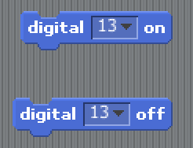

Click on the On button, what happens? Click on the Off button, what happens? You should see LED 13 on your Arduino turn ON and then OFF. If you do not see this effect, possibly you have the two blocks connected. Separate them. Consider why this does not produce the correct result. 	

### Your First Program
Consider all the work you would have to go through if you wanted a program that would blink a light forever. You would have to sit their and click each button over and over... This is not why we have computers. What kind of instructions would we want to give to the computer if we wanted it to blink a light forever. Possibly we would want it to turn ON, wait some time, and then turn OFF?

Look in the yellow "Control" tab and find a block called "delay". Insert a delay between your ON and OFF blocks. Click the blocks to execute your new "program". What happens? Does the light blink as expected? How do you think you might make the light turn on for longer?

> 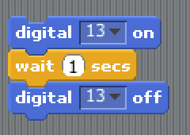

We've made some progress but the light only blinks when we tell it too. Look again in the Control blocks and see what block you might use to make the light blink "forever". Use your new pac-man like abilities so the Forever block "eats" your current program and makes a new one.

> 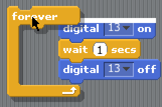

Try out this new program. Does it make your program blink forever? Why not? Consider that once the program hits the bottom of the forever loop it immediately begins at the top again. Given too small duration of time you may never see the desired result. Correct your program and make it blink properly.

## Part 4: Making Things Move

### Turning the Servo
Now that you can blink a light ON and OFF its time to make your Arduino control something in the real world. Look in your box for a large black Continuous Servo. There should be several wheels and adapters that can be attached to it as well.

Look at the electrical connections for the servo. There should be three connection points colored: red, black, and white. Using wire from your kit: connect the RED port to 5V, the BLACK port to GND, and the white port to Digital Pin #8. Do this while your Arduino is unplugged so you do not short any power. Once connected, your servo and Arduino should look like the images below:

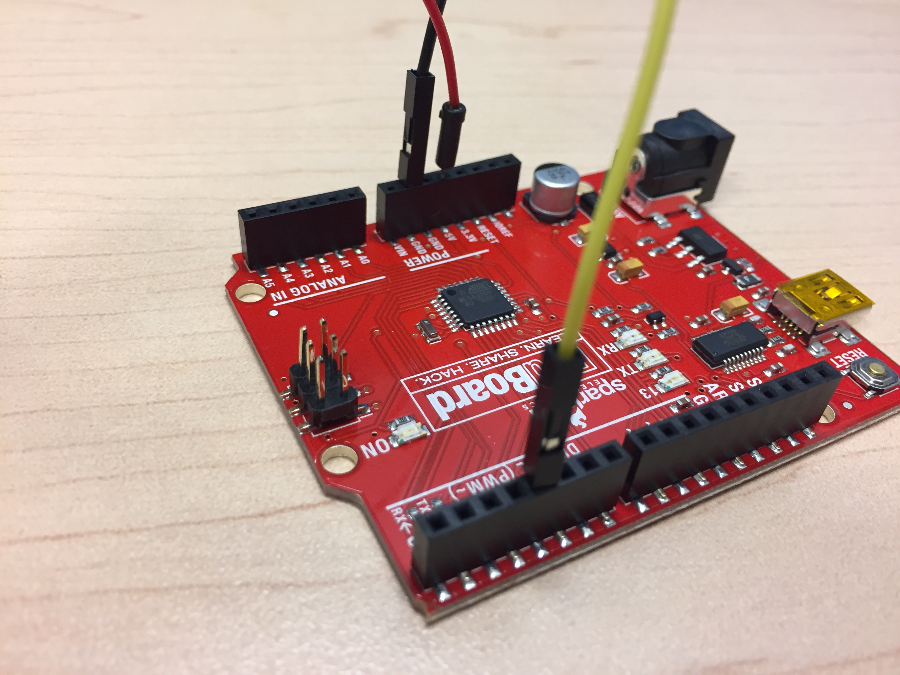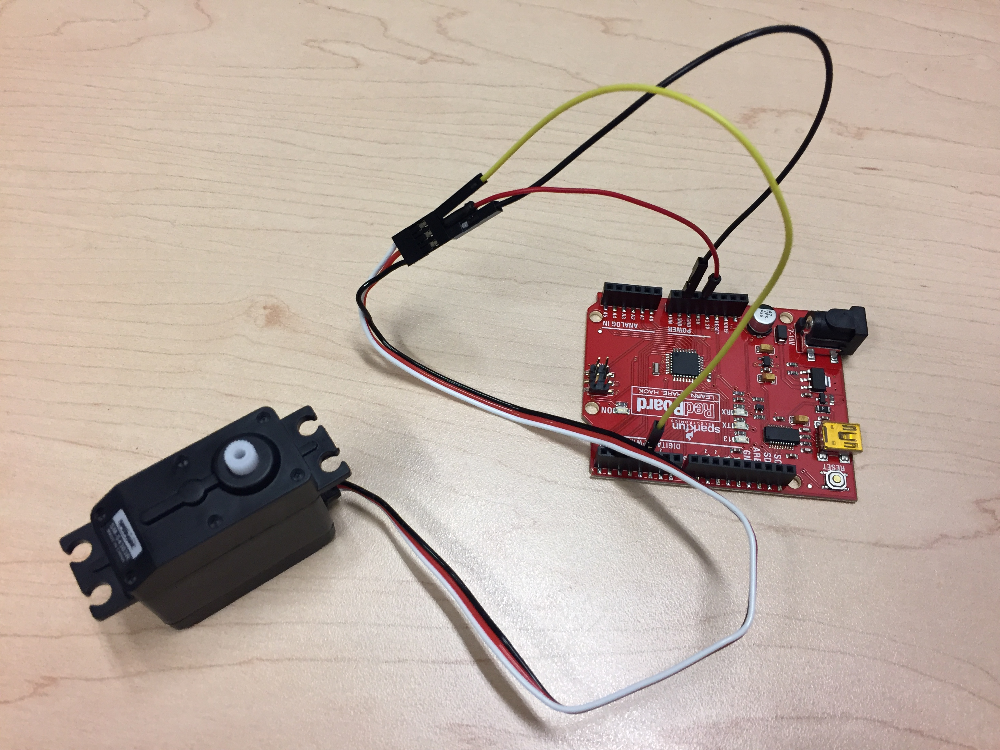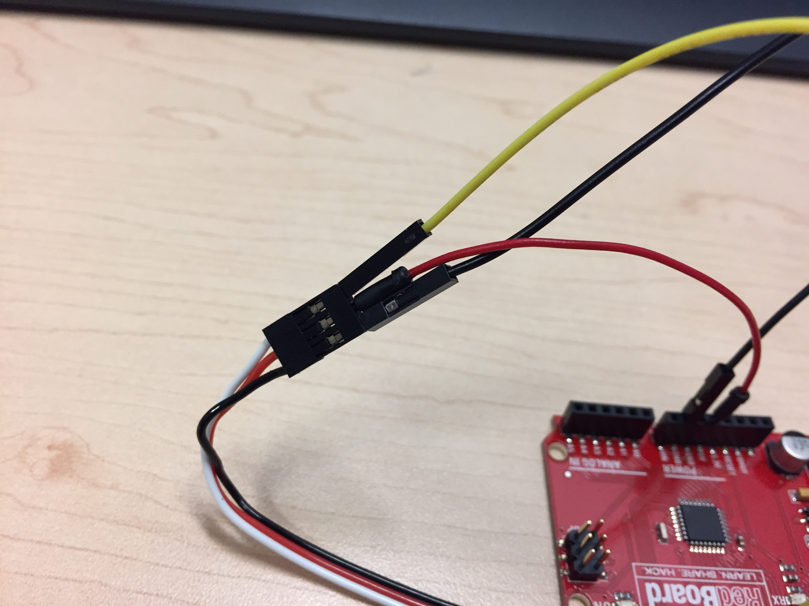

After wiring up your servo you can now control it from within Scratch. Use the "Motion" block called Motor Direction to control the motor. Make sure the block has Pin #8 selected (the same one you connected it up to).

> 

Click on the motor block to see what happens. Make sure the motor begins turning. You can change the direction by clicking on the direction tab and changing between "clockwise" and "anti-clockwise". Also, you can change the pin that is controlled by changing from #8 to a another pin. Note: if you have too many motors active you may pull too much current and short circuit the USB port.

One important thing about Scratch is that each component remembers the last thing you told it to do. If you tell the servo to turn clock-wise, it will continue to do so until you give it another direction or tell it to stop. Use the "Motor Off" block within the motion table.

### Your Second Program
Just like the LED, write a program that makes the servo turn LEFT for one second, RIGHT for one second, and then repeats. Your program will have the exact same structure as the LED program but with different commands.

## Part 5: Reading in Data from the Real-World

Using the LED and sero you can create light and make some object move. However, you can only do these things based upon the program that you write, not from any physical response provided to the computer. If you have a sensor that produces a voltage then you can read it in through the Analog Input ports. <b>Important:</b> The ports can only accept voltages between 0V and 5V. Anything above or below will damage the Arduino. You shouldn't have to worry about this but don't hook up random equipment unless we've provided it or you've shown it to us first.

### Wiring Up the Force Sensitive Resistor (FSR)
Take a look in your kit and you will need the following items:
* Round "Force Sensitive Resistor" with two small leads at the end. 
* Small bread board where we will create the circuit needed for the Force Sensitive Resistor.
* A single 1K resistor. It should have the colors RED, BLACK, BROWN. If you do not have one in the kit, grab one from the resistor kit provided.

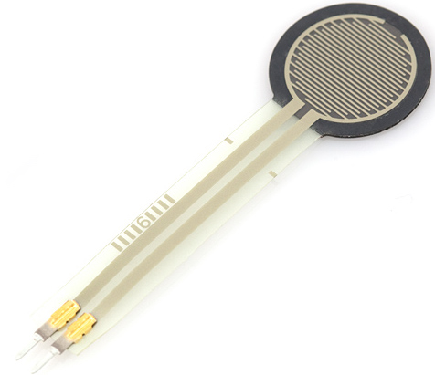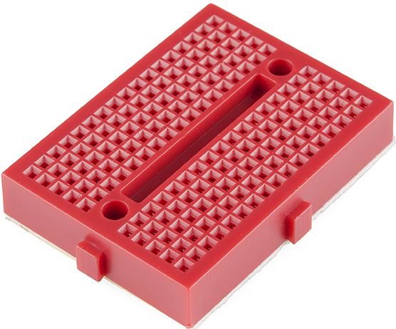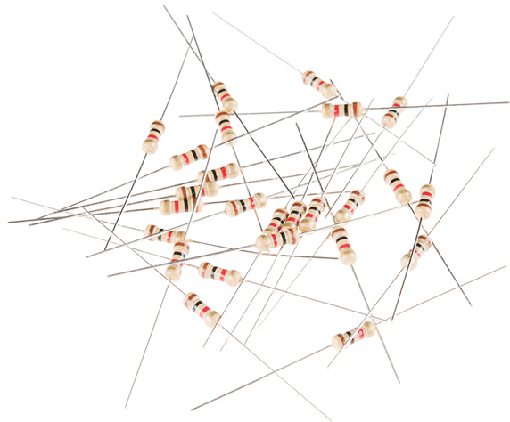

To ensure that the FSR works we need to create a simple circuit to power it. We will wire up our circuit on a "Breadboard" (the big red thing in the pictures). When looking at a breadboard, each row is electrically connected, and each column is independent. That means if you put to wires in the same "row" then they will be connected. We will use the breadboard to temporarily connect our components. Two breadboards are shown below. Each green line indicates a "row" that is connected. Some breadboards also have "power rails" that provide additional connections.

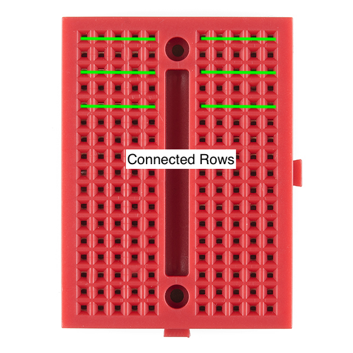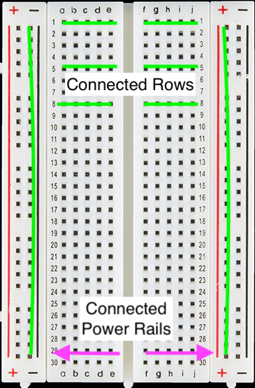

Remove your servo from the circuit and wire it up based upon the diagram below. Make sure not to connect power and ground together! You will need to make a connection between <b>5V</b>, <b>GND</b>, and <b>Analog Input 0</b>.

> 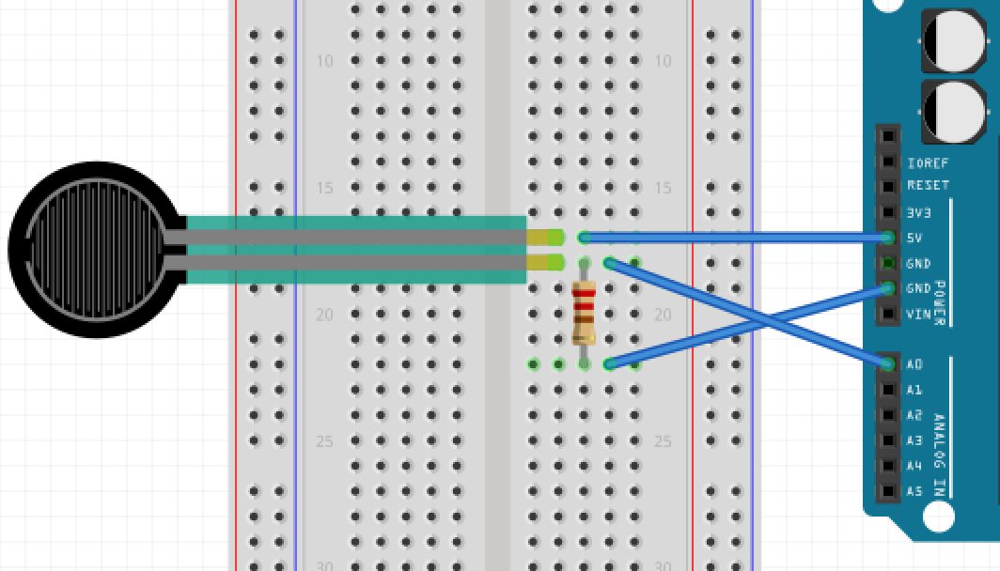

After it is wired up your FSR circuit should look like below:

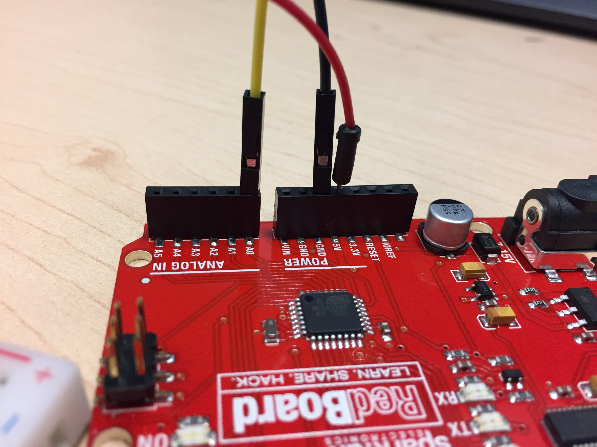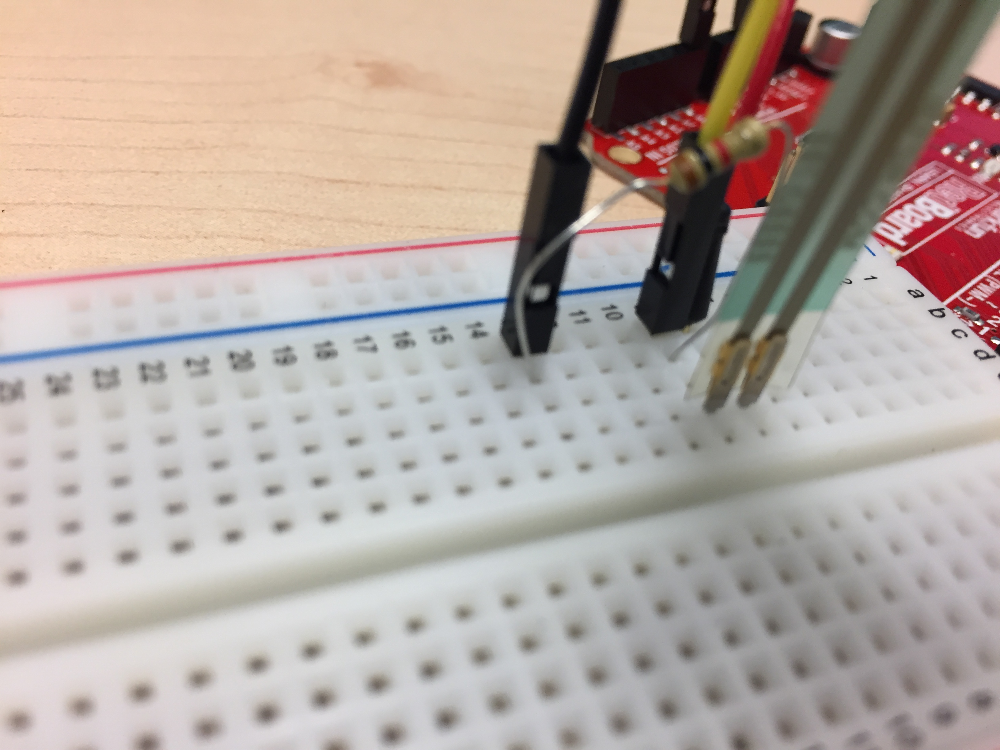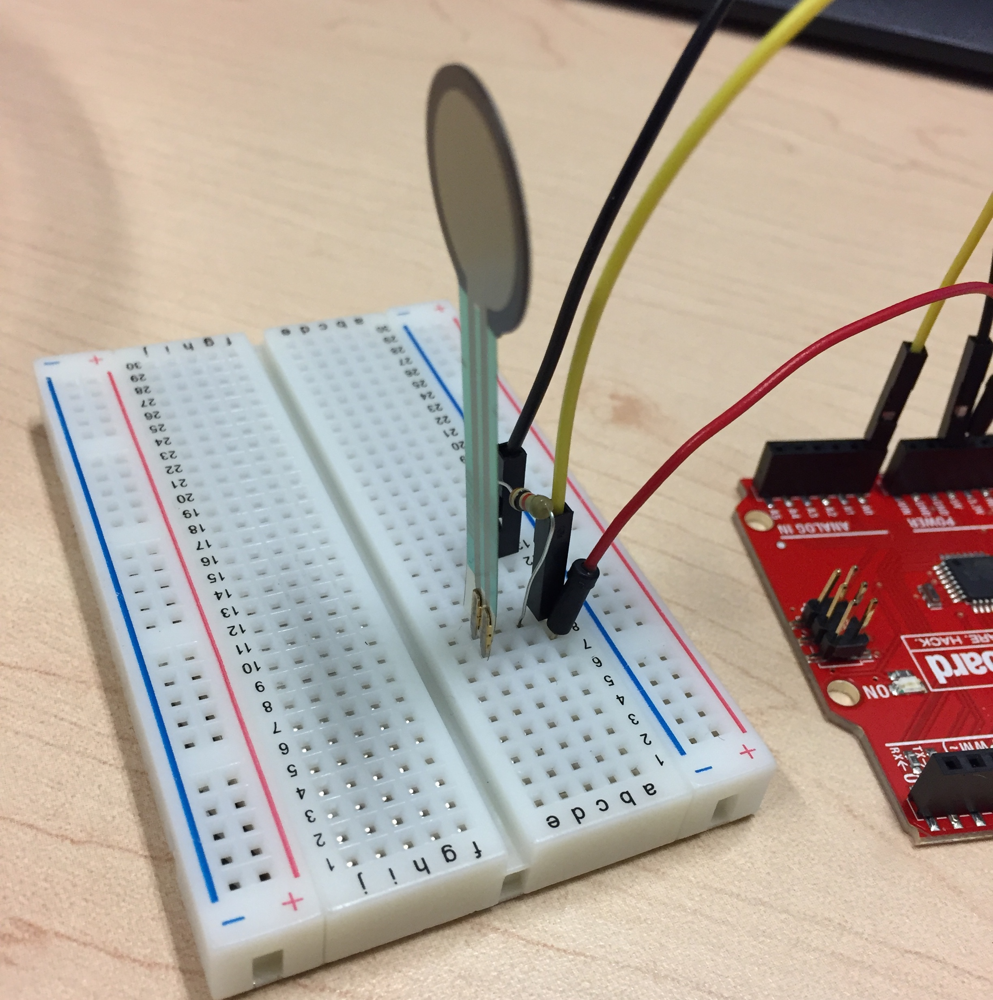

### Reading Data from the Outside World
The Analog Input pins on your Arduino read in data from the outside world. While they read analog values between 0V and 5V, these voltages are reported in the program as a value between 0 and 1023. The value of 0 corresponds to measuring 0V and 1023 to measuring 5V. 

Use the "SAY" block from the "Looks" tab and an "value of sensor" block to create the program below  This will cause the little Arduino graphic to "say" the value measured from Analog Input 0 forever.

> 

Squeeze the pressure sensor and notice the how the measured value changes. If it's stuck at a single value then likely you have something wired up incorrectly in your circuit. 

### Playing Music on your FSR
Reading in data is useful only if you can do something fun with it. Scratch has built-in MIDI instruments that you can use. Try out the program below to make a pressure sensitive piano or glockenspiel. You change the type of instrument before the "forever" loop.

> 

Try this:
* Change out the different instruments used.
* Duplicate your block and see what two instruments at the same time sound like.

## Part 6: 	Combining Input and Output
Now you have learned how to control some external device (servo) and read in some data from the outside world. The purpose of Physical Computing is to combine those elements together. As a first example, we are going to control the servo using the value from the FSR. Once you learn to do this then you can replace any input with virtually any output to make more interesting programs.

To start, we will need to re-wire your servo. Since our 5V and GND ports are already consumed on the Arduino, use the existing connections on the breadboard. Connect the RED line on the servo to the 5V row on the breadboard, and the BLACK line on the servo to the GND row. The WHITE line will still need to go to Digital Pin 8.

Once you have completed the wiring you can now combine the elements of reading from Analog Input 0 and controling the servo. For a simple program, lets turn the motor ON if the sensor is greater than 500, otherwise the motor will be OFF. To accomplish this we will need an IF-ELSE block from the "Control" table. This block performs some logical test and if the test is TRUE some action is performed, otherwise a different action is performed. 

To construct this block we will need to use blocks from the "Operators" tab to perform the test as shown below. The ">" operator fits inside the top portion of the IF-ELSE block.

> 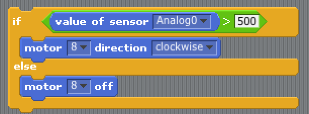

Try this:
* Change the value (500) of the test in the block. What happens at different levels?
* Try making the servo turn the other direction if it is less-than 500.
* Try three different (nested) tests. Make the servo turn clockwise between [0-200], stop between [200-800], and counter clockwise between [800-1023]

# Going Forward
There are many different sensors that we can cover and show you. However you have learned the basics by reading in information and using it to control some actuator. There are several other sensors within you kit that you can try. Some are inputs, others are outputs. Use the [Connecting Physical Sensors Guide](../labs/ConnectingSensors.pdf) to wire up a few more. For each sensor there is also a "User-Friendly Datasheet" that describes how you can utilize it.

* [Accelerometer](../resources/datasheets/Accelerometer.pdf)
* [Force Sensitive Resistor](../resources/datasheets/ForceSensitiveResistor.pdf)
* [Motion Detector](../resources/datasheets/MotionDetector.pdf)
* [Photocell](../resources/datasheets/Photocell.pdf)
* [Reed Switch](../resources/datasheets/ReedSwitch.pdf)
* [RGB LED](../resources/datasheets/RGBLED.pdf)
* [Servo Motor](../resources/datasheets/ServoMotor.pdf)
* [Ultrasonic Range Finder](../resources/datasheets/UltrasonicRangeFinder.pdf)
* [Vibration Motor](../resources/datasheets/VibrationMotor.pdf)

