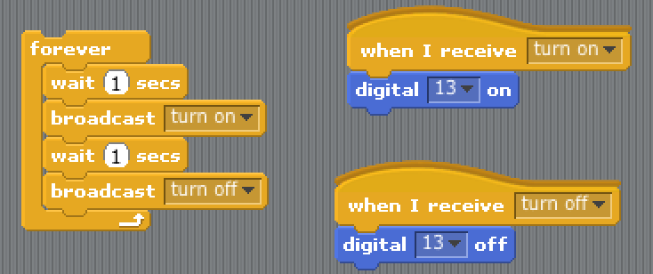

# Learning goals

* Describe a prototype system to be implemented
* Identify which sensors and actuators are neccessary for a system
* Create small Scratch programs to detect and respond to input and output events

# What To Do

Your challenge today is to design a children's toy using the sensors and actuators from the Arduino kits and using the physical materials from the Rube Goldberg kits. The first step to creating any system is to have a description. From that description we will break it down into various input and output devices and then to individual blocks of code.

## Part 1 - Describing Your System
Take a sheet of paper and divide it into three equal sections. Number each section 1, 2, 3 with 1 being at the top. In this top section write a small description of what you want your toy system to do. The description should be general and 2-3 sentences at most. An example description would be:

> <i>Whenever the child picks up the toy it squeeks like a mouse. Upon throwing the ball it yells "Weeeeee!" until it is caught or hits the ground.</i>

## Part 2 - Identifying Inputs and Outputs
With your description of the toy you need to identify the <i>inputs</i> and <i>outputs</i> that are needed to implement your system. An <i>input</i> is any event that your device responds to. Inputs can be caused by some human event (a button is pressed), some contextual event (someone is nearby), or any other information you desire (time of day, the weather in Tokyo...etc.). An <i>output</i> is any action that your device does in response to some input. These actions can cause the device to move, light up, send a message, or any other modality that you can envision.

For each event or action that you device responds to there must be an associated sensor, actuator, or information source. If your device is to respond to touch, what sensor would be useful for detecting touch? If your sensor is to produce light or motion, what actuator could be used to perform that action? If you are to respond to the weather in Toyko, how will it gather that information?

In the second portion of your worksheet:
* Write a small description for each input event your device will respond too and each output action that it will created.
* For each description identify the hardware or information sources that will be used to detect the event or create the action.

An example of a good description would be:
> <i>Input: The ball responds to the event of being picked up. I will use the accelerometer to detect the change in motion so it knows it's moving.</i>

><i>Output: The ball creates the action/sound "Weee!" sound while in motion. I will use a small speaker to create the sound. </i>

To help you remember what each sensor does take a look at the "User-Friendly Datasheet" that describes how you can utilize it.

* [Accelerometer](../resources/datasheets/Accelerometer.pdf)
* [Force Sensitive Resistor](../resources/datasheets/ForceSensitiveResistor.pdf)
* [Motion Detector](../resources/datasheets/MotionDetector.pdf)
* [Photocell](../resources/datasheets/Photocell.pdf)
* [Reed Switch](../resources/datasheets/ReedSwitch.pdf)
* [RGB LED](../resources/datasheets/RGBLED.pdf)
* [Servo Motor](../resources/datasheets/ServoMotor.pdf)
* [Ultrasonic Range Finder](../resources/datasheets/UltrasonicRangeFinder.pdf)
* [Vibration Motor](../resources/datasheets/VibrationMotor.pdf)

## Part 3 - Writing Code with Messages and Variables
From the previous steps above you should have a good description of what your device should do and the hardware needed to accomplish the task. Here we will discuss ways to write code that will make implementing your device easier. 

One property of Scratch is that all block "stacks" are indepedent programs. In the image below two Scratch programs are running at the same time. The program on the left is blinking LED 13 and the other is playing a constant sound. 

> 

To help implement your prototype we will write small programs for each input event and output action. These smaller programs will work in parallel and coordinate with the each other. It is easier to debug smaller programs than a much larger one. We will then use variables and messages to pass information between the two programs.

### Passing Information with Messages
Scratch supports the ability to pass messages between two different programs. This allows each block to do one small thing and then broadcast it to the other blocks. The code below uses a "broadcast" block to create a new message called "Turn On".

To receive a message from another program the block called "When I Receive" is used. It will trigger a program whenever a particular message is broadcast. The programs below listen for the messages "Turn On" and "Turn Off" and respond appropriately. The blocks below implement a fully parallel program that blinks LED 13 but with each block implementing some small portion of the program. <b>Try it out on your computer to see it in action.</b>

> 

### Saving Information with Variables
While creating your program you may need to store information that can be used by other programs. To accomplish this we will use <i>variables</i> within Scratch. Variables can be created in the "Variables" tab within Scratch. Make sure to give them a useful name so you can remember their purpose.

Variables are useful for storing information from your sensors. For example, if you are using the pressure sensor, you will want a dedicated program that constantly reads the value in from the pressure sensor and stores it. This way the information can be seen by all programs in the project. When you create a new variable, custom blocks are created that allow you to change the variable's stored information.

Variables can be more helpful than messages as they contain quantitative information about some event. While a message tells your whether something <i>did</i> or <i>did not</i> occur, a variable can tell you <i>how much</i> of something is being measured. As an example, the program below constantly reads in the value of the pressure sensor from Analog Input 0, stores the value in the <i>pressure</i> variable, and then uses it in another program to play different sounds.

> 

<b>Important!:</b> Whenever working with variables they should be continously updated. In the program above if there was not a "Forever" block around where <i>pressure</i> is set the variable would only update once.

## Part 4 - Writing Programs for the Children's Toy
Now that you know how to pass messages and save to variables you can begin working on the children't toy. To help build your prototype we will write individual programs that handle the input and output operations in parallel. Your program should be very modular containing many smaller block programs.

For each <b>input</b> that you described in Part #2:
* Read the "User-Friendly" datasheet to determine how to wire up the sensor and which Scratch blocks are used to work with the device.
* In Section #3 of your worksheet, write a short (1-2 sentence) description of how the program will detect/measure the input. A good sentence would be <i>"I will use the pressure sensor conencted to analog 0. I will constantly read in the value and save it to a variable called 'pressure'"</i>
* Create an individual program that uses either Messages or Variables to implement the program you just described. Create custom blocks that do small operations. Use variables to store information and messages to pass events between blocks.

For each <b>output</b> that you described in Part #2
* Read the "User-Friendly" datasheet to determine how to wire up the actuator and which Scratch blocks are used to work with the device.
* In Section #3 of your worksheet, write a short (1-2 sentence) description of how the program will respond based upon some variables or messages. A good setence would be <i>"The program will constantly read the pressure variable. The higher the variable, the brighter the LED and vice versa."
* Create an individual program that responds to either Messages or Variables to implement the program you just described. Create custom blocks that do small operations.

## Part 5 - Show Off Your Work!
Once your prototype is up and running, show it your classmates and the instructors to try it out! :)
