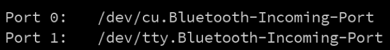
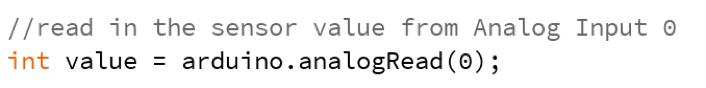

# Learning goals

* Learn to write simple Processing programs that interface with your Arduin
* Explore connections between physica input/out and graphical expressions

# What to Do

In the previous lab we have examined how to connect various sensors to the Arduino using Scratch. While Scratch enables us to make simple Arduino programs, it is limited to only communicate with the Arduino itself. To expand the range of possible Arduino interactions, we will access the Arduino directly from a Processing sketch. This will enable you to incorporate animation, sound, and other visual elements with physical input or output.

## Part 0 - Setup Processing to Work with Arduino

To enable Processing to talk with your Arduino you will need a couple things: (1) a new Arduino library and sketches for Processing, (2) a new firmware installed on the Arduino.

### Loading New Processing Libraries and Sketches

Download the Arduino processing library ([here](./lab12/arduino.zip)). Unzip the archive and place it in your <b>libraries</b> folder within you Processing Sketchbook.

> 

To install the sketches for today, open the "lab-12Sketches.zip" ([here](./lab12/lab12-sketches.zip)) folder and drag all of the contents into your <b>Processing sketchbook</b>.
> 

### Installing Firmata on Arduino
Once you have installed both libraries you need to install a new firmware on your Arduino so it can talk to Processing. Launch Arduino from your desktop. Once in Arduino, load the Firmata software by going to <b>File->Examples->Firmata->Standard Firmata</b>. This should bring up the StandardFirmata firmware program. 

Plug in your arduino. Once you have selected the Firmata program you need to select the correct <b>COM port</b> and <b>Board Type</b> for your program. Go to Tools->Port and select the "largest" COM port. For example, if you have COM3 and COM8, choose COM8. Also you need to select a board type. Ensure the "Arduino/Genduino Uno" is selected.

> 

Once you have made those two choices you are now ready to upload to your board. Press the "Right Arrow" 
> 

Your program should now upload to the Arduino. If successful, you will see the message below after a few seconds:

> 

## Part 1 - Connecting to Your Arduino
When using the Arduino library in Processing you can directly communicate with the Arduino by turning on/off pins and requesting different values. However, before you perform these activities you must first establish a connection to the Arduino.  

Load up sketch “Blink LED” from your Processing Sketchbook. Examine the setup() loop of the sketch as shown below:

> 

The first line <i>Arduino arduino</i> creates an Arduino object that we will talk to. The subsequent lines print out the different serial ports on the computer. You must select the serial port that your computer is actually connected. This can be challenging as the output is not human-readable. The subsequent lines print out the different serial ports on the computer. You must select the serial port that your computer is actually connected. The code will print out the list of available serial ports in the terminal below your sketch. The figure below shows the list of ports available on my Mac. Yours will look different.

> 

In general, you want to select the “largest” port value. In this instance I would select Port 1. As you can see in the code below, I selected port 3 on an earlier install. You will change the value 3 to whatever value is good for your Arduino.

> 

## Part 2 - Blinking an LED
To use a pin on the Arduino that pin must be declared as either an INPUT or an OUTPUT. Input pins bring information into the Arduino. Output pins produce some information. Most of your pins will be output pins.

In this sketch will blink the onboard LED, much like you did in Scratch. To begin, we need to set pin 13, which is connected to the LED, as an output. The line below in setup() performs this operation.

> 

Once we have set pin 13 to be an output, it can be used in draw() to blink the LED. Examine the code below and note the similarities with your Scratch code. Instead of blocks, we have individual lines of code.

## Part 3 - Reading in Data
Many of the parts in we have used require an Analog Input to read in data- the photocell, pressure sensor…etc. Accessing this information is very similar in Processing. Load up the sketch called “SimpleAnalogRead” and setup a simple circuit for the Photocell [(Photocell Datasheet)](../resources/datasheets/Photocell.pdf) or Pressure Sensor [(Pressure Sensor)](../resources/datasheets/ForceSensitiveResistor.pdf). Use the [Connecting Physical Sensors Guide](../labs/ConnectingSensors.pdf) if you need help.

In SimpleAnalogRead the setup loop should be the same as the others. If the serial port is incorrect, please change the port value as you did in the beginning of the lab.

Examine the <i>draw()</i> loop shown below. This code reads in a value from Analog Input 0 and stores that value in a variable called <i>value</i>. Value has a <i>type</i> called <i>int</i> which simply means that it stores positive or negative integers. 

> 

An equivalent Scratch version of this code would look Figure 6. Instead of using a single block to read in the sensor and assign it, we are using a single statement in Processing.

> 

Once the value has been read in, the Arduino can print out that value and display it in the console. The code also includes a small delay to ensure we do not receive a wall of text in the console. The instruction <i>println</i> stands for “Print Line” and will print out different variables in the console.

> 

When running, you should see output similar to the values below that show data coming through the Arduino and into the console.

> 

## Part 4 - Controlling a Servo
In Scratch we used special motor blocks to control the servo. In Processing we will write to the servo directly to control its operation. In general, sending a value of <b>0</b> to the servo will cause it to move counter clockwise and sending a value of <b>180</b> will cause it to move clockwise. A value in the middle will cause it to stop. Currently, I used <b>92</b> to make the servo stop.

Load up the sketch called “Servo” and examine the <i>draw()</i> loop. The <i>setup()</i> loop should be the same as the previous sketches.

Just above the <i>draw()</i> loop I used a variable to hold the pin that the servo is connected to. We can technically use a digital pin on the Arduino, however I have restricted this to pin 3 which also worked in Scratch.

> 

Having setup the pin, we can now cause the motor to rotate different directions and then stop. Notice the different values that are used to cause the motor to spin different directions. Try out different value to get different results.

> 

Try this:
* Change the servo values between 0 and 180 to see different behaviors

## Part 5 - Connecting Processing and Arduino

### Range Finder
Now that you’ve had an introduction to working with an Arduino in Processing, it is now time to connect the two. Load up the sketch called RangeFinder and wire the Range Finder to your Arduino. Use the [Connecting Physical Sensors Guide](../labs/ConnectingSensors.pdf) and [Ultrasonic Range Finder Datasheet](../resources/datasheets/UltrasonicRangeFinder.pdf) if you need help.

The setup() loop should be the same as before but the draw() loop is different. In this loop we begin to mix Arduino and Processing instructions. Like before, we read in a value from the sensor, but then use that value to make a simple animation.

> 

The figure above shows code that reads the range finder result into a variable called “value” and then coverts that value into another variable called “inches”. The new variable is the actual distance measured by the range finder. Using that distance, an ellipse is drawn on the screen and the distance is printed below it (code not shown).

Things to try:
* Use different fill colors in your sketch
* Aim your range finder at different objects and see how “noisy” it is

### RGB LED

Using your breadboard and the RGB LED, wire up your LED to the following pins:
* Red to Arduino Pin 3
* Green to Arduino Pin 5
* Blue to Arduino Pin 6
* wire up the long LED pin to Ground. 

See the [Connecting Physical Sensors Guide](../labs/ConnectingSensors.pdf) and [RGB LED Datahseet](../resources/datasheets/RGBLED.pdf) for more information.

Once the wiring is complete, load up the sketch called “RGB_LED”. This sketch uses many output pins and so there are many declarations of the outputs in the <i>setup()</i> loop. As a short cut, I have made variables that contain the pin number for each:

 

Examine the code in the <i>draw()</i> function shown below. This code sets a value for each LED color. Just like in Scratch, we use the Analog Write function to set the intensity of the LED. Go to  and try manually creating different values and colors.

> 

Try this:
* Try out different color combinations with the LED. What's your favorite color?

## Part 6 - Connecting Processing and Arduino – LED and the Mouse
In previous sketch we found that it is possible to manually control the LED color. While this is interesting, it is quite boring to select a new color each time. Load up the sketch called “ColorWheel”.

In this sketch, Processing will display a color wheel that provides all variations of RGB colors. Keep your LED installed on your Arduino and watch what happens when you click a particular color. You should notice that your LED becomes the colors that you clicked on the screen.

Processing captures your mouse click and then determines what color you selected. Examine the mouseMoved function to see how this works. Processing first captures your mouse click by finding the mouseX and mouseY values and grabs the color of that pixel. Then, it breaks apart the pixel into its different color values.

> 

After each color has been extracted, those individual colors are sent to the LED. The blue and green values are decreased slightly as they are very bright and overwhelm the red color.

> 

Try this:
* Change the function from mouseClicked() to mouseMoved() and see how your sketch behavior changes

## Part 7 - Connecting Processing and Arduino - Inputs and Outputs
The final part of this lab is to connect an input device (the photocell) and an output device (the onboard LED) together. To do this, wire up the photocell as shown in the previous lab documentation. Load up the sketch called “PhotoCellandLED”.

The first two lines of the sketch should be familiar as they are directly from the Analog Input example. These two lines read in and print the sensor value.

> 

However, the following lines show something different: an IF-ELSE statement.

> 

An IF-ELSE statement is simply a way to make your program do one thing or another, but not both. In this code, the program tests whether the sensor data stored in “value” is less than 300. If so, the LED is turned on. Otherwise the LED is turned off.

Try this:
* Change the “<” sign to a “>” sign and see the difference in behavior
* Change the “<” sign to “==” (two equals). What happens to your code when == is used? (Note: the == operator tests for equality).

# Going Forward
You now know how to connect Processing to your Arduino and vice versa. These interfaces could provide interesting interaction for physical and visual experiences. While you are not required to use Processing, it can make for very novel projects!

