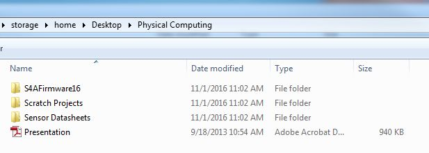

# Learning goals

* Learn to write simple programs in Scratch For Arduino
* Explore simple input and output devices in Scratch 4 Arduino

#What to Do
Before beginning this lab, please download the Physical Computing archive to your desktop. Unzip the archive and you should see the contents of a folder that look like the image below: 

> 
