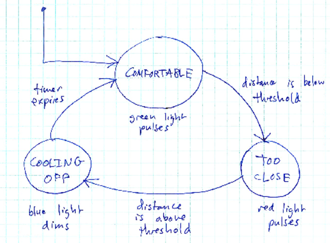

# Learning goals

* Be able to design a state machine to model user interaction with a device
* Be able to implement a state machine in a Processing sketch

# Introduction

A *state machine* is an abstract machine that consists of *states* and *transitions*.  State machines are an extremely useful model for the behavior of computer-based systems.

A *state* represents "what the system is currently doing".  At any given instance in time, one state is the "current" state.  Each state machine has a designated initial state, which is the state that the system will be in when it starts.

A *transition* represents an event that the system processes.  A transition is represented as an arrow leading from one state to another.  Usually, transitions lead to a different state, but sometimes a transition might result in the system staying in the same state.

In designing an interactive system such as [the one you proposed](../assign/assign02.html), modeling its behavior as a state machine is a great way to translate your system requirements into code.  State machines are especially useful for interactive systems, where input from sensors will be used to determine the system's behavior.

# Your Task

Your group has two tasks:

1. Draw a state machine representing the user interaction model for your system
2. Create an Arduino sketch (using the Arduino Processing library) that implements the state machine to carry out the system's intended dynamic behavior

# Example state machine

This is an application (using Processing and Arduino) which detects proximity using a range finder.  Normally, the system is "comfortable", and flashes green.  If the proximity falls below a threshold, then someone is "too close" and the application reacts by flashing red.  When the proximity increases above the threshold again, the system "cools" off (showing blue until a timer expires) and then returns to the "comfortable" state.

Here is the state diagram:

> 

## Translating to Processing

Translating a state machine to Processing is pretty easy.

First, we make an enumeration from the system states:


enum State {
  COMFORTABLE,
  TOO_CLOSE,
  COOLING_OFF,
}


There is a global (visible to all functions) variable to keep track of the current state:


// Variable to keep track of the current state
State currentState = State.COMFORTABLE; // COMFORTABLE is the initial state


The `draw` function of the Processing sketch will look something like this:


State nextState;

switch (currentState) {
  case COMFORTABLE:
    nextState = exec_COMFORTABLE();
    break;
  case TOO_CLOSE:
    nextState = exec_TOO_CLOSE();
    break;
  case COOLING_OFF:
    nextState = exec_COOLING_OFF();
    break;
  default:
    throw new IllegalStateException("Unhandled state: " + currentState);
}

currentState = nextState;


Each state is associated with a function.  A state's function has two responsibilities:

1. Generate the outputs for the state
2. Read inputs and switch to another state if appopriate

For example, here is the `exec_TOO_CLOSE` function:


State exec_TOO_CLOSE() {
  // Generate outputs
  float x = 2.0;
  float theta = ticks / x;
  float r = ((sin(theta) + 1.0) / 2.0) * 255.0;
  arduino.analogWrite(redPin, (int)r);
  
  // Determine next state
  State nextState;
  if (dist <= THRESHOLD) {
    // Stay in TOO_CLOSE state
    nextState = State.TOO_CLOSE;
  } else {
    // Transition to COOLING_OFF state
    nextState = State.COOLING_OFF;
    
    // Turn off red
    arduino.analogWrite(redPin, 0);
    
    // Set initial coolingOff counter value.
    coolingOff = COOLING_OFF_TIME;
  }
  
  return nextState;
}


Each state function returns the next system state.  Note that when a function decides to switch to another state, it may need to do some cleanup and/or initialization to get ready for the next state.

Here is the complete sketch:

> [InMySpace.pde](https://github.com/ycpcs/fys100-fall2018/blob/gh-pages/labs/InMySpace.pde)

