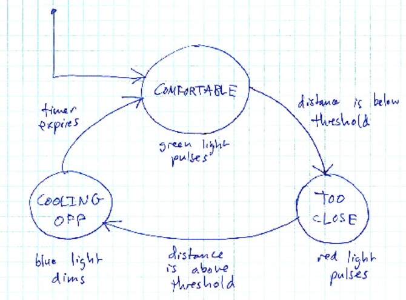

# Concept

This is an application (using Processing and Arduino) which detects proximity using a range finder.  Normally, the system is "comfortable", and flashes green.  If the proximity falls below a threshold, then someone is "too close" and the application reacts by flashing red.  When the proximity increases above the threshold again, the system "cools" off (showing blue until a timer expires) and then returns to the "comfortable" state.

Here is the state diagram:

> 

# Translating to Processing

Translating a state machine to Processing is pretty easy.

First, we make an enumeration from the system states:


enum State {
  COMFORTABLE,
  TOO_CLOSE,
  COOLING_OFF,
}


There is a global (visible to all functions) variable to keep track of the current state:


// Variable to keep track of the current state
State currentState = State.COMFORTABLE; // COMFORTABLE is the initial state


The `draw` function of the Processing sketch will look something like this:


State nextState;

switch (currentState) {
  case COMFORTABLE:
    nextState = exec_COMFORTABLE();
    break;
  case TOO_CLOSE:
    nextState = exec_TOO_CLOSE();
    break;
  case COOLING_OFF:
    nextState = exec_COOLING_OFF();
    break;
  default:
    throw new IllegalStateException("Unhandled state: " + currentState);
}

currentState = nextState;


Each state is associated with a function.  A state's function has two responsibilities:

1. Generate the outputs for the state
2. Read inputs and switch to another state if appopriate

For example, here is the `exec_TOO_CLOSE` function:


State exec_TOO_CLOSE() {
  // Generate outputs
  float x = 2.0;
  float theta = ticks / x;
  float r = ((sin(theta) + 1.0) / 2.0) * 255.0;
  arduino.analogWrite(redPin, (int)r);
  
  // Determine next state
  State nextState;
  if (dist <= THRESHOLD) {
    // Stay in TOO_CLOSE state
    nextState = State.TOO_CLOSE;
  } else {
    // Transition to COOLING_OFF state
    nextState = State.COOLING_OFF;
    
    // Turn off red
    arduino.analogWrite(redPin, 0);
    
    // Set initial coolingOff counter value.
    coolingOff = COOLING_OFF_TIME;
  }
  
  return nextState;
}


Each state function returns the next system state.  Note that when a function decides to switch to another state, it may need to do some cleanup and/or initialization to get ready for the next state.

Here is the complete sketch:

> [InMySpace.pde](https://github.com/ycpcs/fys100-fall2016/blob/gh-pages/labs/InMySpace.pde)
